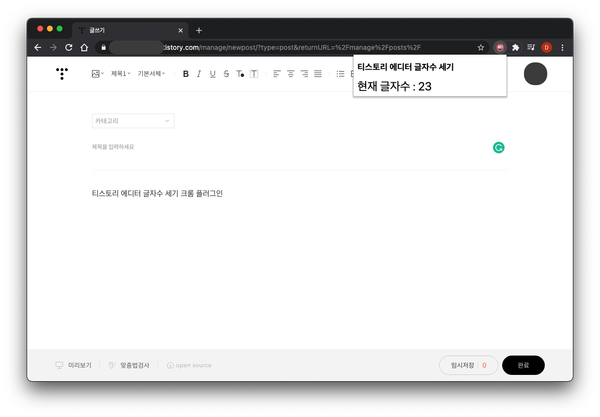

# editor-text-counter

## 티스토리 에디터 글자수 세기 크롬 플러그인

티스토리 에디터에서 곧바로 현재 입력한 글자수를 확인하고 싶어서 [생활코딩 강의](https://opentutorials.org/module/2503/14051)를 참고하여 만들었습니다.

- 티스토리 **KEditor(기본모드)** 에서 사용 가능.
- 티스토리 에디터 페이지에서 확장 프로그램 아이콘을 클릭하면 글자수 표시
- 현재 에디터에서 엔터 입력시 글자수가 **3회 카운트**됩니다.(추후 개선 예정)

## 사용법
1. 여기 [다운로드](https://github.com/improve777/editor-text-counter/releases/download/v1.0/editor-text-counter-v1.0.zip) 클릭
3. 다운 받은 zip 파일을 압축 해제
4. 크롬 브라우저에서 [확장 프로그램] - [개발자 모드] - [압축 해제 된 확장 프로그램 로드] - 압축이 풀린 폴더를 추가  
[크롬에 확장 프로그램 추가 방법](https://sunstar2.tistory.com/1676)

## 문제 발생시
- 혹시 정상적으로 기능이 동작하지 않는다면 improve777@gmail.com 로 문의해주시면 감사하겠습니다.