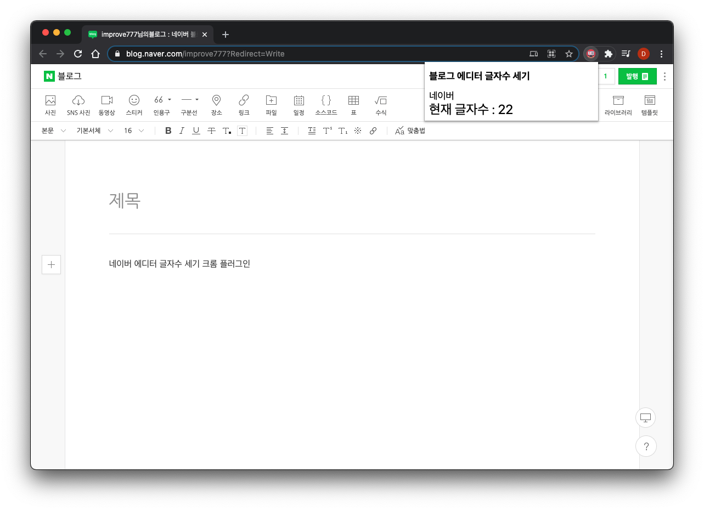
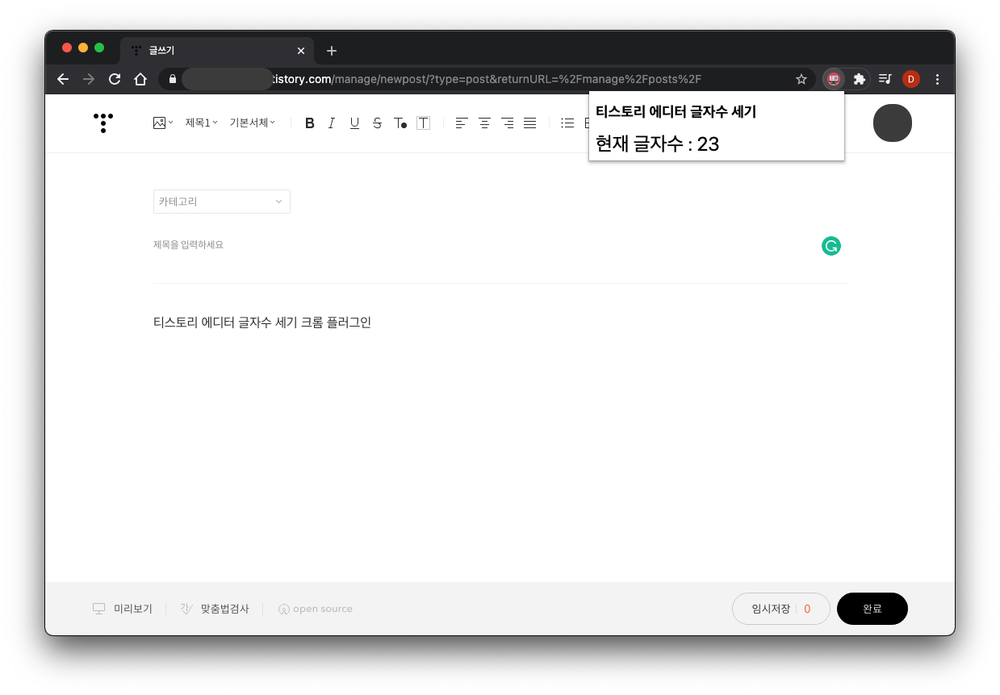
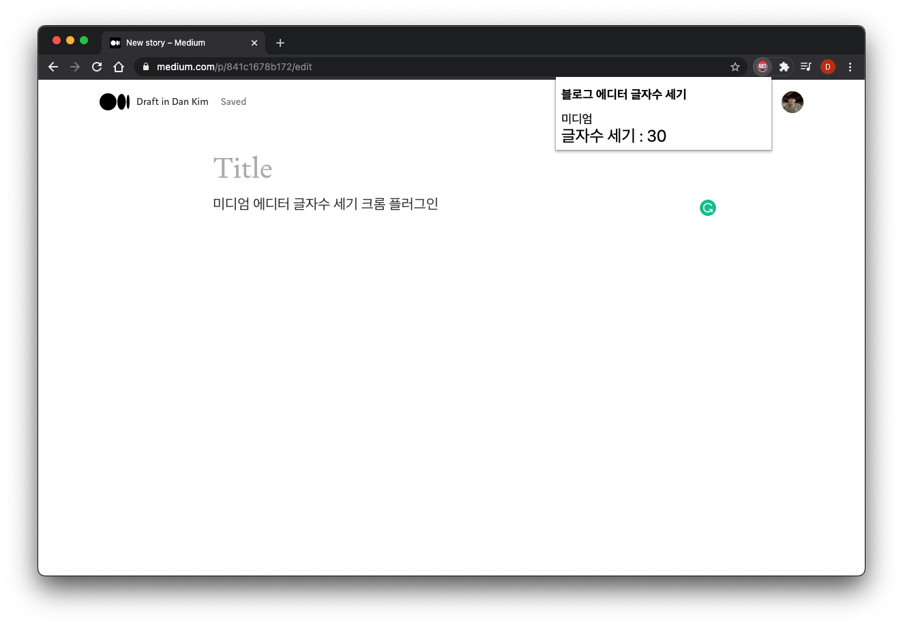
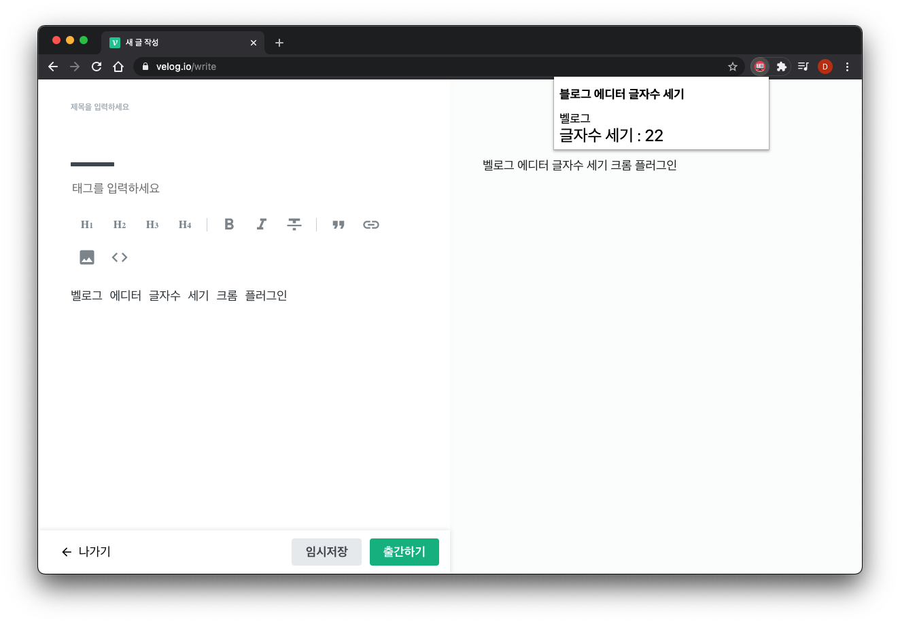

# editor-text-counter

## 블로그 에디터 글자수 세기 크롬 플러그인

블로그 에디터에서 곧바로 **현재 입력한 글자수**를 확인하고 싶어서 [생활코딩 강의](https://opentutorials.org/module/2503/14051)를 참고하여 만들었습니다.

## 지원
- 각 에디터 페이지에서 확장 프로그램 아이콘을 클릭하면 글자수 표시

1. **네이버 스마트에디터**
2. **티스토리 KEditor(기본모드)**  
   - 현재 티스토리 에디터에서 엔터 입력시 글자수가 **3회 카운트**됩니다.(추후 개선 예정)
3. **미디엄 에디터**
   - 제목 포함 카운트
4. **벨로그 에디터**

## 사용법
1. 여기 [다운로드](https://github.com/improve777/editor-text-counter/releases/download/v1.2/editor-text-counter-v1.2.zip) 클릭
3. 다운 받은 zip 파일을 압축 해제
4. 크롬 브라우저에서 [확장 프로그램] - [개발자 모드] - [압축 해제 된 확장 프로그램 로드] - 압축이 풀린 폴더를 추가  
[크롬에 확장 프로그램 추가 방법](https://sunstar2.tistory.com/1676)

## 스크린샷

## 문제 발생시
- 혹시 기능이 정상적으로 동작하지 않는다면 improve777@gmail.com 로 문의해주시거나, [이슈](https://github.com/improve777/editor-text-counter/issues)로 등록해주시면 감사하겠습니다.